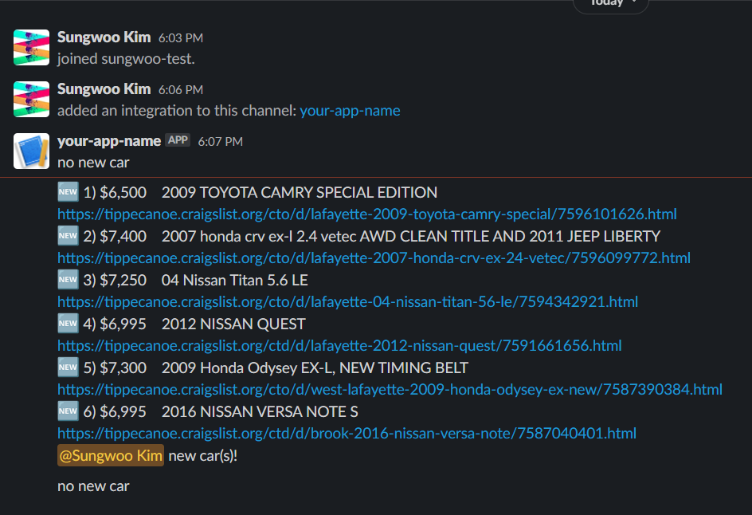

# craigslist used car crawler



Crawls the tippecanoe county craigslist.  
Sends an alert to Slack channel when "affordable cars" appear.  
Affordable cars :
1. Price range 4000$ ~ 7800$ ***and***
2. Toyota, Honda, Nissan, Acura, or Lexus

## Run

0. `npm i`
1. Add below into `.env`: 
- Slack web hook URL:  
https://api.slack.com/messaging/webhooks
- Member id(s) whom you want to notify:  
https://www.workast.com/help/article/how-to-find-a-slack-user-id/
2. Run. `pm2 cron` may be useful:  
```bash
# Run every 30 mins
pm2 start index.js --cron "*/30 * * * *"
```
